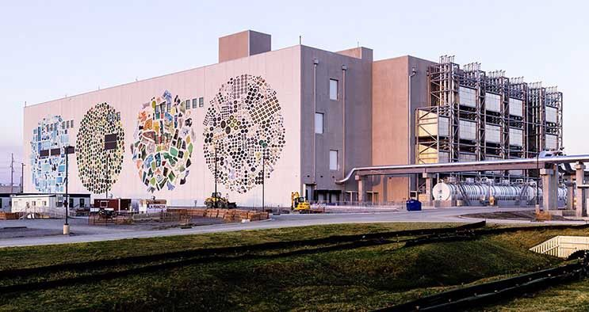
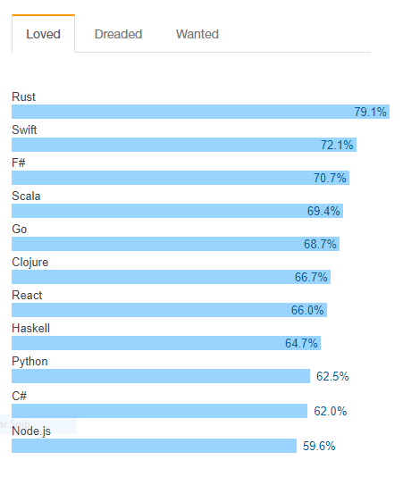

Don’t reinvent the wheel! Build on the shoulders of giants! These terms have been irreversibly planted into our heads, and for good reason, but in an industry that is continually producing new options and opinions , it can be difficult to decide who’s shoulders to stand on.

It’s not just tools and frameworks either. There are many processes, philosophies and the definitions of “Good code”; All streaming past the eyes of developers leading them to conclude that “The industry is moving quickly

## Moving Where?

But, moving where? Moving seems to imply direction. It implies that the latest solution is the best way to tackle all problems.

Software solutions don’t work like that, we have many different types of problems and even more perfectly acceptable ways to solve them. Yes there is an explosion of functional programming on hackernews at the moment, but let’s not forget that LISP arrived in 1958.

The best Ideas , don’t arrive in chronological order.

Ask yourself, Is this your data center?

> Not your Data Center

Is it four stories high? Google developed MapReduce to run on this sort of hardware, an entire building. Yet they also own Firebase, because they know that sometimes all you need to do is store a JSON object.

## Noise is not signal

Another trap we can fall into when following the news cycle is, mistaking lots of chatter for technological value.

If you follow the typical tech news cycle, you would assume that the most popular, most used JavaScript framework is React. Used by everybody from Netflix to it’s illegal torrent based cousin.

But let’s take this as an example. What happens when we try to find some evidence supporting this?

It was difficult to find objective data to start with, Google results on this topic mainly return Buzzfeed style list articles.

So I turned to the only people who seem to bother collecting data on this sort of thing. I looked at the results of the 2016 Stack Overflow survey. I had some talking points on the 2017 results, but the data had changed by the next time I went to the site, so I deemed it as unstable, and have reverted back to the long term support version.

The results for the most loved technology show that React is indeed loved by people, and that would explain why there are so many blog posts, tweets and talks covering it, but it sits among programming languages, the top being a fairly new language not very well known for being used in production.

Suspicions are confirmed when we look at the most popular tech data , which shows that Angular is the absolute king of JavaScript frameworks. React only has half the users that Angular does and falls out of the top 10 list for full stack developers.

Just because something has a lot of buzz around it, doesn’t mean it’s the best tool for the job.

## Consider the team

Finally, you need to consider your team.

Just because a framework, process or paradigm made another team more productive doesn’t mean that your team will benefit from it.

Again I will use JavasScript frameworks an example, because they seem to be more fickle, and I also know that these frameworks are aimed at thinking that’s promoted by a certain skill set. For instance , Angular was aimed at people used to doing development in Java or C#, while Ember was aimed more at the Ruby developer.

It may be better to choose technologies that build on the same concepts that your team is already fluent in, instead of making a complete switch to something that doesn’t quite match your current stack and contributes more to the fatigue of context switching.

## Conclusion

It’s very easy to get caught up in the storm of news , excitement and developer advocate bombardment. But when it comes to making decisions that you and your team have to live with, you should remember:

 - Other people’s solutions don’t always match yours
 - The best tool for the Job is probably not the most hyped toy
 - Consider the team, choose technologies that fit well with your current stack and skill set
