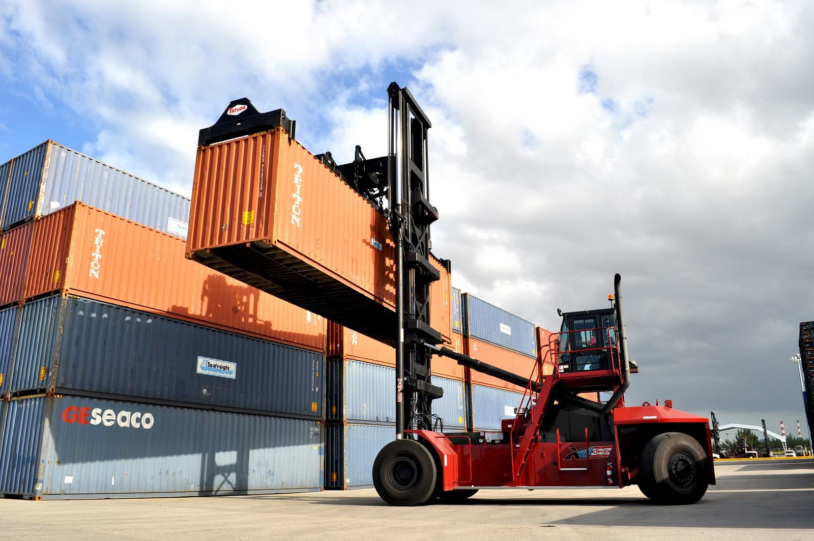

There are 2 types of people in this world, those who think [Docker](https://www.docker.com/) is an absolute game changer when it comes to web application development, and those who don't know what Docker is. If you belong to the latter group, my goal here is to make you part of the former.

Most modern web applications who's scope extends beyond "Hello World" will at some point encounter a situation where they will interact with another application over a network connection, be that a database, logging system or any other type of network application. Most of these applications require specific setup and dependencies, some can even span different languages and ecosystems, or worst of all, 2 different versions of the same language.

This makes it hard enough to set up in production, but can become even worse when you are trying to set up a developer environment and find that you need to install Erlang and 2 different versions of Ruby just to get one of your dependencies up and running so that you can work on YOUR part of the app.

Docker eases the pain of installing these networked dependencies through the use of a concept called [containerisation](https://www.docker.com/resources/what-container).


## What does this have to do with forklifts?

Containerisation in the software world, has transformed it in the same way that putting real life objects inside containers has transformed the shipping industry.

Lets take a look at this forklift:

> A forklift can only lift containers

You will notice something about this forklift, it can only lift one kind of object. It would be impossible, or at least damaging if we were to attempt to use it to lift a car, or a pile of boxes or a shipment of sensitive electronics, yet this forklift probably lifts all of these objects every single day, that's because all of these differently shaped objects are stored *inside* of shipping containers, and the forklift is really good at lifting those.

Docker containers are like those shipping containers, they can contain different types of software that have different dependencies but because they are in a container it allows us to treat them all the same way.

## A concrete example

Let's have an example. Ruby is a language I have barely touched and I certainly dont have a ruby environment set up. However docker still allows me to install an app written in a specific version of Ruby which I most likely don't even have installed on my machine. All I need is to have installed is docker itself.

```sh
docker run -p 8080:8080 --name ruby-hello-world openshift/ruby-hello-world
```

## Why compose matters

[](https://mermaid-js.github.io/mermaid-live-editor/#/edit/eyJjb2RlIjoiZ3JhcGggVERcbiAgRkUoRnJvbnRlbmQpIC0tPiBHXG4gIEcoR2F0ZXdheS9CRkYpIC0tPlUoVXNlciBTZXJ2aWNlKVxuICBVIC0tPiBEQlsoUG9zdGdyZXMpXVxuICBVIC0tPiBSW1JhYmJpdE1RXVxuICBSIC0tPiBNKE1haWwgU2VydmljZSlcbiAgVSAtLT4gTChHcmFwaCBNYW5hZ2VtZW50IFNlcnZpY2UpXG4gIEwgLS0-IE5bKE5lbzRqKV1cblx0XHQiLCJtZXJtYWlkIjp7InRoZW1lIjoiZGVmYXVsdCJ9LCJ1cGRhdGVFZGl0b3IiOmZhbHNlfQ)


> Header photo by https://unsplash.com/@chuttersnap