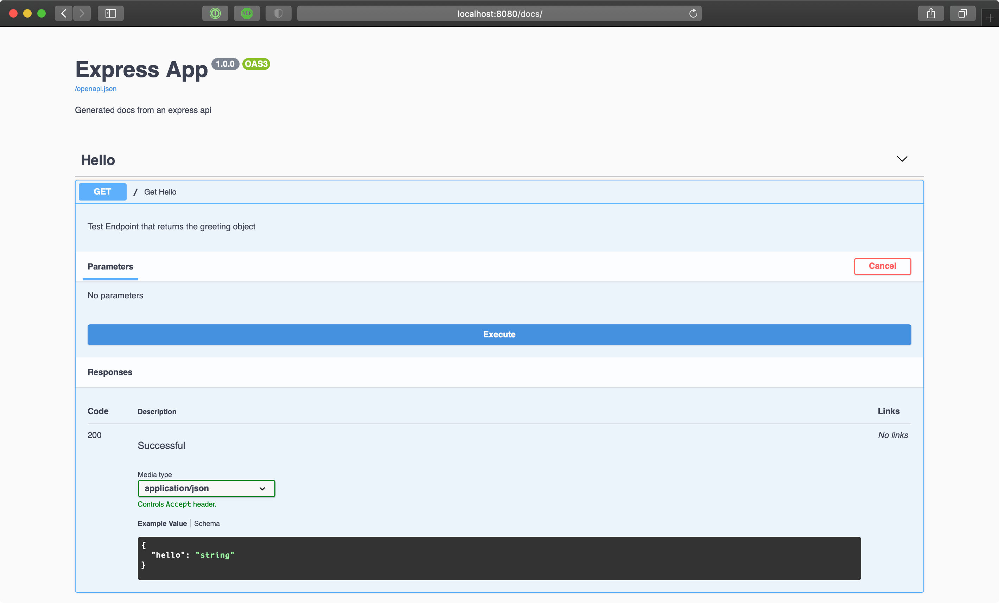

While there are many options for using Swagger/OpenAPI with express some of them require that you use an entire framework while others like to enforce strange structures that quite frankly feel like they interfere with your independant descisions way too much.

In this tutorial I will cover what I think is the easiest way to [add documentation to your API](https://dvisagie.com/post/open-api/).

First let's put together a simple express app that simply returns the object `{greeting: 'Hello World'}`. 

```jsx
const express = require('express')
const app = express()
const port = 8080

app.get('/', (req, res) => {
    res.json({
        greeting: 'Hello World'
    })
})

app.listen(port, () => {
    console.log(`listening on http://localhost:${port}`)
})
```

We can test this by browsing to [http://localhost:8080](http://localhost:8080).

Right, so now that we have an existing API lets add swagger documentation to it. We will be using `@wesleytodd/openapi`. Lets install that now.

```bash
npm i @wesleytodd/openapi
```

In order to use the library we must first import it

```js
const openapi = require('@wesleytodd/openapi')
```

Then before the endpoint we declare our openapi definition

```js
...
const oapi = openapi({
    openapi: '3.0.0',
    info: {
        title: 'Express App',
        description: 'Generated docs from an express api',
        version: '1.0.0'
    }
})
...
```

With our definition loaded we now import it as an express middleware with `app.use(...)`.

```js
...
app.use(oapi)
...
```

You will now be able to access your openAPI definition at [http://localhost:8080/openapi.json](http://localhost:8080/openapi.json).

However you will notice that this only contains our base definition and no information about our endpoint:

```json
{
  "openapi": "3.0.0",
  "info": {
    "title": "Express App",
    "version": "1.0.0",
    "description": "Generated docs from an express api"
  },
  "paths": {}
}
```

In order to generate documentation for our endpoints we need to insert the relevant documentation information, this again makes use of the middleware api. A nice feature about the way it is done here is that the documentation structure is in JSON and maps directly to the way a normal swagger/openapi json file would look. This means that you can refer to the [official openapi documentation](https://swagger.io/specification/) and don't have to rely on library abstractions being correctly documented.

Our get endpoint now becomes:

```js
app.get('/', oapi.path({
    tags: ['Hello'],
    summary: 'Get Hello',
    description: 'Test Endpoint that returns the greeting object',
    responses: {
        200: {
            description: 'Successful',
            content: {
                'application/json': {
                    schema: {
                        type: 'object',
                        properties: {
                            hello: { type: 'string' }
                        }
                    }
                }
            }
        }
    }
}), (req, res) => {
    res.json({
        hello: 'world'
    })
})
```

With this change in place, the library now has enough information to generate the full documentation of our API browsing to [http://localhost:8080/openapi.json](http://localhost:8080/openapi.json) will now return the following.

```json
{
  "openapi": "3.0.0",
  "info": {
    "title": "Express App",
    "version": "1.0.0",
    "description": "Generated docs from an express api"
  },
  "paths": {
    "/": {
      "get": {
        "tags": [
          "Hello"
        ],
        "summary": "Get Hello",
        "description": "Test Endpoint that returns the greeting object",
        "responses": {
          "200": {
            "description": "Successful",
            "content": {
              "application/json": {
                "schema": {
                  "type": "object",
                  "properties": {
                    "hello": {
                      "type": "string"
                    }
                  }
                }
              }
            }
          }
        }
      }
    }
  }
}
```

Having this documentation in JSON format can be super useful, you can even import it onto postman as a collection, however `@wesleytodd/openapi` also provides easy integration with SwaggerUI. Simply add `openapi.swaggerui` at any endpoint you desire, here I have chosen to put mine at the `/docs` route.

```js
app.use('/docs', oapi.swaggerui)
```

And that's it, we have documented an express API in what in my opinion is the clearest and least complicated way, you can now view and test your endpoints at [http://localhost:8080/docs/](http://localhost:8080/docs/).



Just in case you aren't quite sure where some of the code goes, here is a copy of the full API:

```js
const express = require('express')
const openapi = require('@wesleytodd/openapi')

const app = express()

const oapi = openapi({
    openapi: '3.0.0',
    info: {
        title: 'Express App',
        description: 'Generated docs from an express api',
        version: '1.0.0'
    }
})

app.use(oapi)
app.use('/docs', oapi.swaggerui)

app.get('/', oapi.path({
    tags: ['Hello'],
    summary: 'Get Hello',
    description: 'Test Endpoint that returns the greeting object',
    responses: {
        200: {
            description: 'Successful',
            content: {
                'application/json': {
                    schema: {
                        type: 'object',
                        properties: {
                            hello: { type: 'string' }
                        }
                    }
                }
            }
        }
    }
}), (req, res) => {
    res.json({
        hello: 'world'
    })
})

const port = 8080
app.listen(port, () => {
    console.log(`listening at http://localhost:${port}`)
})
```
