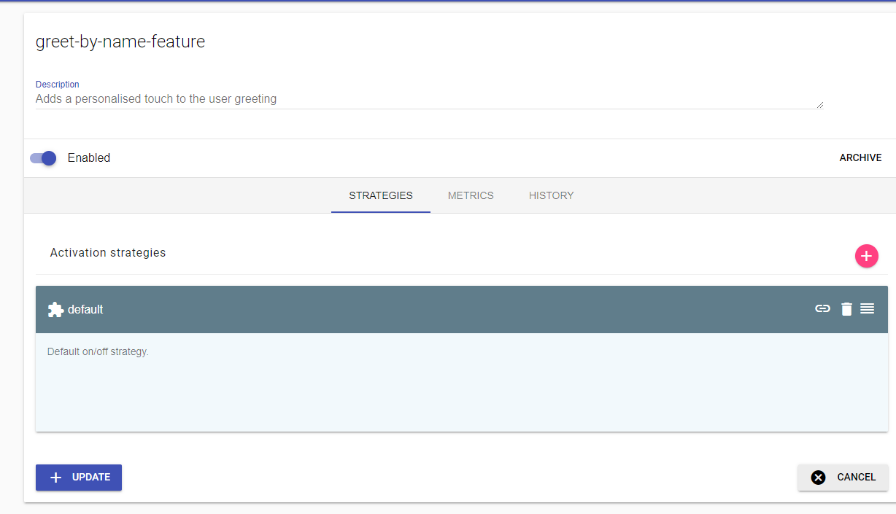

In it's simplest form. A feature flag is an if statement. Lets take the example of an endpoint that returns the string `"Hello World"` when the user browses to [`/greeting`](http://locahost:8000/greeting):

```ts
app.get('/greeting', (req, res) => {
    res.send('Hello Hello')
})
```

Now lets suppose that we deploy this useful functionality to production, but after a few weeks, we get the idea that maybe we want to change it to greet the user directly by including their name from the database. Now, we could simply change this functionality and deploy a new version:

```ts
app.get('/greeting', (req, res) => {
    let user = getUserDetails(req)
    res.send(`Hello ${user.name}`)
})
```

However this version will roll out to everyone at the same time and if anything goes wrong, for example there may be a bug in `getUserDetails()`, we would then have to roll back our entire release. This may seem minor given this simple example, but in the real world we may be releasing multiple features in a single release and the rollback will affect all of those changes too, this happens because we now have a feature *Rollout* that is tightly coupled with the *Deployment*.

What we want to do is decouple Rollout and deployment. A better way would be for us to perform a check on a configurable variable so that we could choose to switch between features and allow us to roll back simply by changing the value of the configuration for that feature:

```ts
app.get('/greeting', (req, res) => {
    if (config.getBool('greet-by-name-feature')) {
        let user = getUserDetails(req)
        return res.send(`Hello ${user.name}`)
    }
    res.send('Hello World')
})
```

And that, is what I meant when I said that a feature flag in it's simplest form is an if statement. Its simply a check to see if the new code should be executed, and if it isn't then the old code runs as normal.

## Managing flags

The feature flag we implemented here allows us to roll out and roll back without redeploying our application, but there are risks. Depending on how our `config.getBool()` funciton works, we may need to restart the application to cause the value to change, or the value may live inside a config file that we would have to remote into the production server to change, which in a microservices architecture could be near impossible to get right.

Ideally we would want to have a centralised  management system for these flags so that we can respond more rapidly if we need to roll back a feature. While there isn't necessarily anything wrong with rolling your own feature flag system, it is a domain on it's own that requires many considerations and can cost you valuable time... and even money. 

One particular example is from a comp... well former company called Knight Capital, who's [reuse of a feature flag](https://dougseven.com/2014/04/17/knightmare-a-devops-cautionary-tale) caused an 8 year old bit of code to run unexpectedly; ultimately ending in the company's demise.

If you need any more convincing about using a proper flag management system, check out: [Feature Toggles: The Good, The Bad, and The Ugly with Andy Davies](https://youtu.be/r7VI5x2XKXw).

> I highly recommend watching this talk as it points out the serious potential pitfalls that come with using feature flags

## Choosing a feature flag system

There are several very viable options when it comes to feature flag management systems, but two of them really stand out to me:

- LaunchDarkly
- Unleash

*LaunchDarkly* is a very full featured [SAAS](https://en.wikipedia.org/wiki/Software_as_a_service) solution, and also caters for A/B testing and experimentation. One of my favourite features which I discovered while using it was that it will actually mark a flag as no longer used, which serves as a great notification that it's time to clean up that check in your code. LaunchDarkly is however a paid for product and may be overkill for a lot of projects that have much more basic needs.

*Unleash* is a much more lightweight, open source self-hosted solution that also has a (less prohibitively expensive for a normal human being) SAAS component called [Unleash Hosted](https://www.unleash-hosted.com). To me it's biggest benifit is the fact that I can package an instance for development by simply adding it to a `docker-compose.yml` file in the respective project, and it's for this reason I chose I will be using it in the code examples in the rest of this post.

## Using Unleash

You can choose to either use Unleash as a cloud service or run your own instance. 
To run unleash in your project. Simply add the following to your docker-compose.yml

```yml
version: '3'
services:
  unleash:
    image: unleashorg/unleash-server:3.1
    ports:
      - "4242:4242"
    environment:
      DATABASE_URL: postgres://postgres:unleash@db/postgres
    depends_on:
      - db
  db:
    expose:
      - "5432"
    image: postgres:10-alpine
```

After running the command `docker-compose up` you will now have access to an Unleash interface at [http://localhost:4242/](http://localhost:4242/).

Let's take our earlier greeting example and convert it to use unleash





```ts
app.get('/greeting', (req, res) => {
    if (config.getBool('greet-by-name-feature')) {
        let user = getUserDetails(req)
        return res.send(`Hello ${user.name}`)
    }
    res.send('Hello World')
})
```


## Progressive delivery

As you have seen so far, feature flags on their own can be valuable because they decouple rollout from deployment, we can easily switch between our old and new code simply by changing a value in our configuration.


[Progressive Delivery](https://searchitoperations.techtarget.com/definition/progressive-delivery)


